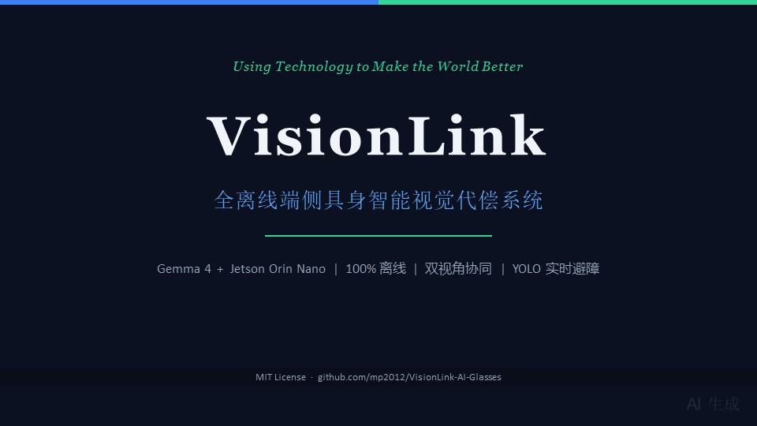
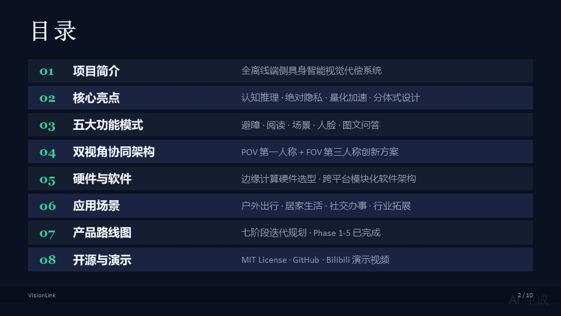
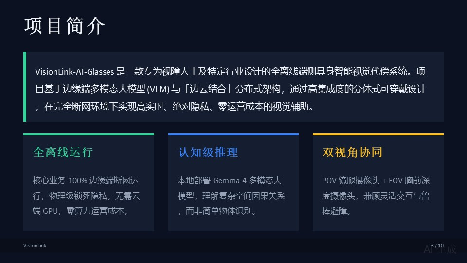
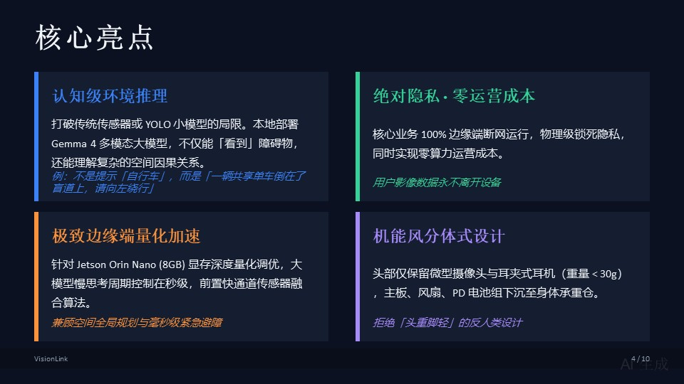
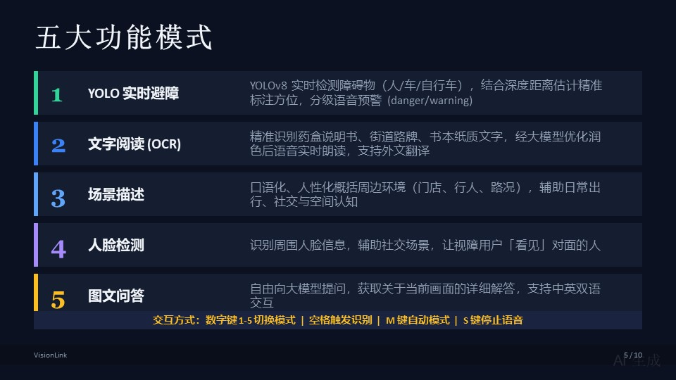
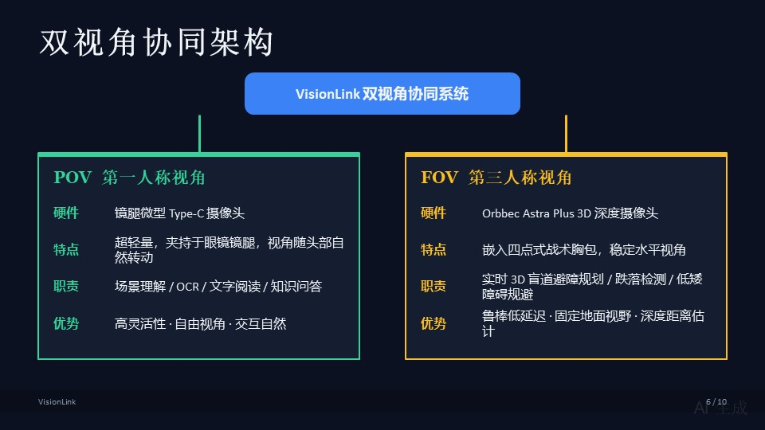
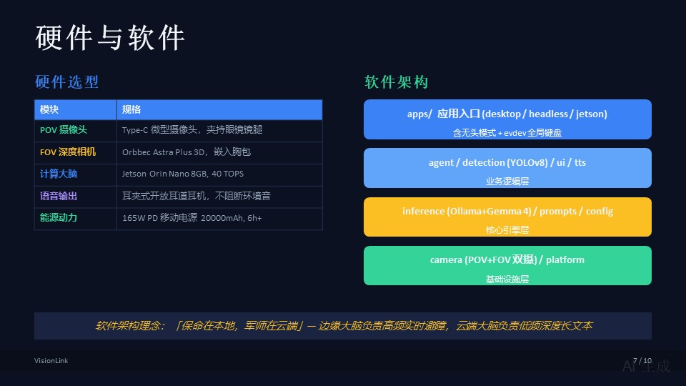
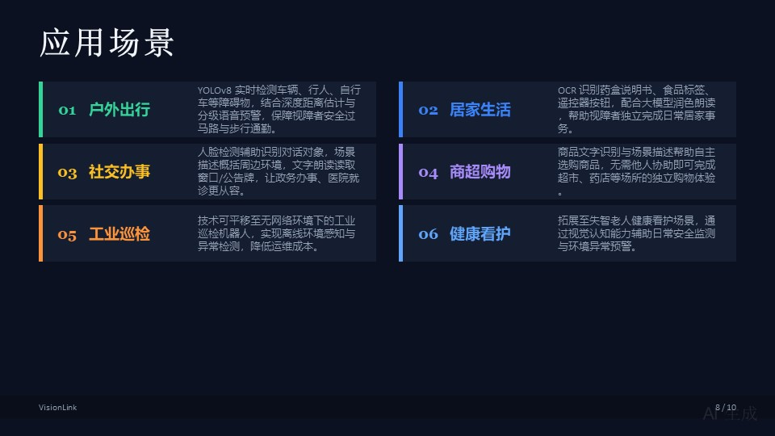
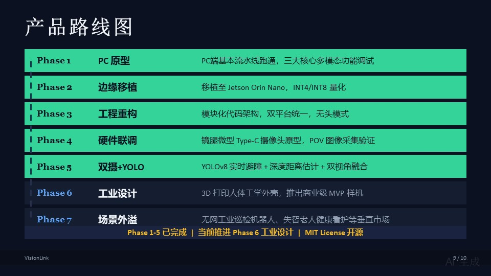

# VisionLink-AI-Glasses

An offline multimodal generative AI assistive system based on Gemma 4 for visually impaired individuals.

> 🎬 **最新 Demo 演示视频**：[点击观看 Bilibili 演示视频](https://www.bilibili.com/video/BV1FmJJ6rEsn/)

---

## 项目展示幻灯片












> 注意：幻灯片中展示的 GitHub 仓库地址（`mp2012/VisionLink-AI-Glasses`）已更新为 [YeetangOcean/VisionLink](https://github.com/YeetangOcean/VisionLink)

---

## 目录

- [VisionLink-AI-Glasses](#visionlink-ai-glasses)
  - [目录](#目录)
  - [项目简介](#项目简介)
  - [核心维度与亮点](#核心维度与亮点)
  - [功能模式](#功能模式)
  - [软硬件架构与实物清单](#软硬件架构与实物清单)
    - [1. 软件架构："保命在本地，军师在云端"](#1-软件架构保命在本地军师在云端)
    - [2. 硬件实物选型清单](#2-硬件实物选型清单)
  - [项目结构](#项目结构)
    - [平台差异](#平台差异)
  - [环境依赖与部署](#环境依赖与部署)
    - [1. Windows 桌面版](#1-windows-桌面版)
    - [2. Jetson Orin Nano 边缘版](#2-jetson-orin-nano-边缘版)
  - [无障碍交互说明](#无障碍交互说明)
  - [产品 Roadmap](#产品-roadmap)
  - [开源协议与致谢](#开源协议与致谢)

---

## 项目简介

**VisionLink-AI-Glasses** 是一款专为视障人士及特定行业设计的**全离线端侧具身智能视觉代偿系统**。项目基于边缘端多模态大模型（VLM）与"边云结合"分布式架构，通过高集成度的分体式可穿戴设计，在完全断网环境下实现高实时、绝对隐私、零运营成本的视觉辅助。

项目依托轻量化多模态模型实现端侧高效推理，面向视障人群打造普惠无障碍出行辅助产品，深度契合 **Google Hackathon 赛道 B: Multimodal（多模态赛道）** 的评审方向。

---

## 核心维度与亮点

* **🧠 认知级环境推理**：打破传统传感器或 YOLO 等小模型的局限。本地部署 Gemma 4 多模态大模型，不仅能"看到"障碍物，还能理解复杂的空间因果关系（例如：不是生硬地提示"自行车"，而是提示"一辆共享单车倒在了盲道上，请向左绕行"）。
* **🔒 绝对隐私，零运营成本**：响应视障用户对个人隐私的极高要求，核心业务 100% 边缘端断网运行，物理级锁死隐私，同时实现企业零算力运营成本。
* **⚡ 极致的边缘端量化加速**：针对 **Jetson Orin Nano (8GB)** 显存进行深度量化调优，将大模型的慢思考周期控制在秒级，并前置快通道传感器融合算法，兼顾空间全局规划与毫秒级紧急避障。
* **🎒 机能风分体式工程落地**：拒绝"头重脚轻"的反人类设计。头部（眼镜端）仅保留微型摄像头与不堵塞耳道的耳夹式耳机（重量 < 30g），将主板、风扇、PD 电池组下沉至身体承重仓，打造高辨识度的赛博机能风准商业样机（MVP）。

---

## 功能模式

项目深度联动图像视觉识别、文字理解、语音播报三大模态，提供五类无障碍友好交互：

1. **🟢 YOLO 实时避障模式**：YOLOv8 实时检测周边障碍物（人/车/自行车等），结合深度距离估计精准标注相对方位与预估距离，分级语音预警（danger/warning），保障出行安全。
2. **🟡 文字阅读模式**：精准识别药盒说明书、街道路牌、书本纸质文字，经大模型优化润色后通过语音实时朗读，完美支持 OCR 与外文翻译。
3. **🔵 场景描述模式**：口语化、人性化概括周边环境（门店、行人、路况等），辅助用户日常出行、社交以及空间认知。
4. **🟣 人脸检测模式**：识别周围人脸信息，辅助社交场景。
5. **⚪ 图文问答模式**：自由向大模型提问，获取关于当前画面的详细解答。

---

## 软硬件架构与实物清单

项目采用从 **PC原型验证** 到 **边缘端一体化样机** 的完整全栈开发路径。为兼顾日常交互的高灵活性与路面避障的高鲁棒性，VisionLink 创新性地引入 **"双视角协同"** 硬件方案：

```text
                ┌──────────────────────────────────┐
                │    VisionLink 双视角协同系统     │
                └────────────────┬─────────────────┘
                                 │
       ┌─────────────────────────┴─────────────────────────┐
       ▼                                                   ▼

┌──────────────────────┐                            ┌──────────────────────┐
│   第一人称视角 (POV)    │                            │   第三人称视角 (FOV)    │
│   镜腿微型摄像头       │                            │   胸前深度摄像头       │
├──────────────────────┤                            ├──────────────────────┤
│ 头部随动 Type-C       │                            │ Orbbec Astra Plus    │
│ 微型摄像头            │                            │ 3D 深度摄像头         │
├──────────────────────┤                            ├──────────────────────┤
│ 高灵活性              │                            │ 鲁棒低延迟            │
│ 自由视角              │                            │ 固定地面视野          │
├──────────────────────┤                            ├──────────────────────┤
│ 场景理解 / OCR /      │                            │ 实时 3D 盲道          │
│ 文字阅读              │                            │ 避障规划              │
└──────────────────────┘                            └──────────────────────┘
```

### 1. 软件架构："保命在本地，军师在云端"

* **边缘大脑（Gemma 4 本地运行）**：负责高频、高实时的避障与日常隐私场景，物理隔离，断网可用。
* **云端大脑（联网大模型）**：负责低频、高消耗的深度长文本阅读或全网信息检索，作为本地大脑的后备援军。

### 2. 硬件实物选型清单

| 硬件模块 | 实物图参考 | 规格与作用说明 |
| :--- | :---: | :--- |
| **第一人称视角 (POV)**<br>镜腿微型单目摄像头 |  | **微型 Type-C 摄像头模组**<br>• 超轻量设计，无缝夹持于普通眼镜镜腿，视角随头部自然转动。<br>• 负责灵活交互场景（文字 OCR、红绿灯识别、特定物体辨认、通用知识问答）。 |
| **边缘计算大脑** |  | **NVIDIA Jetson Orin Nano Dev Kit (8GB)**<br>• 系统便携核心，安全收纳于背包/胸包中。<br>• 提供高达 40 TOPS 的 AI 算力，完美运行量化后的端侧大模型。 |
| **第三人称视角 (FOV)**<br>胸前深度摄像头 |  | **Orbbec Astra Plus / 微型 HD 摄像头组件**<br>• 嵌入固定于四点式战术胸包，保持稳定的水平视角。<br>• 输出实时 3D 深度图，专用于路径导航、跌落检测及低矮障碍物规避。 |
| **语音音频输出** |  | **耳夹式开放耳道微型耳机**<br>• 开放耳道设计，私密播报 AI 语音反馈，同时不阻断环境音感知，保障视障用户出行安全。 |
| **能源动力系统** |  | **大功率 PD 快充移动电源 (20000mAh / 165W)**<br>• 人体工学重量分配设计，确保边缘计算机在高吞吐推理负载下持续运行 6 小时以上。 |
| **电力诱骗线缆** |  | **Type-C 转 DC 专用高电流诱骗线**<br>• 内置 PD 快充协议诱骗芯片，完美稳压移动电源输出电压以匹配 Jetson 主板标准。 |

---

## 项目结构

```
VisionLink/
├── src/                    # 核心源码（跨平台）
│   ├── platform.py         # 平台检测与环境适配
│   ├── config.py           # 统一配置中心
│   ├── camera.py           # 双摄像头管理（POV 镜腿 + FOV 胸前）
│   ├── detection.py        # YOLOv8 实时障碍物检测与深度距离估计
│   ├── inference.py        # Ollama 多模态推理（Gemma 4）
│   ├── tts.py              # TTS 语音合成（Piper/espeak-ng/edge-tts 三级回退）
│   ├── ui.py               # UI 绘制（YOLO 检测框叠加，自动适配无头模式）
│   ├── agent.py            # 核心控制中枢（状态机 / 自动模式 / YOLO 回调）
│   └── prompts.py          # Prompt 模板库（中英双语）
├── apps/                   # 应用入口
│   ├── desktop.py          # Windows/Linux 桌面 GUI 全功能版
│   ├── headless.py         # Jetson 无头模式主入口（evdev 全局键盘监听）
│   └── jetson.py           # Jetson 终端键盘兼容版
├── scripts/                # 测试与诊断脚本
│   ├── check_system.py     # 一键系统综合诊断
│   ├── check_camera.py     # 摄像头扫描与诊断
│   └── check_audio.py      # 音频设备检测与 TTS 测试
├── start.sh                # 一键启动脚本（5 种模式）
├── archive/                # 历史迭代版本
├── assets/                 # 静态资源（字体/音频/图片）
├── docs/                   # 文档
├── requirements.txt        # 通用依赖
└── requirements-jetson.txt # Jetson 专用依赖
```

### 平台差异

| 特性 | Windows | Jetson |
|------|---------|--------|
| 模型 | `gemma4:e2b` | `gemma4:e2b-it-qat` |
| AI 分辨率 | 448px | 288px |
| 摄像头 | DSHOW, 单目 | V4L2, 双摄（POV ID=0 + FOV ID=2） |
| TTS | PowerShell SAPI5 | Piper（离线）> espeak-ng > edge-tts |
| 音频设备 | 默认 | AB13X USB Audio (plughw:1,0) |
| UI | 完整面板 | 自动适配无头 / GUI 调试窗口 |

---

## 环境依赖与部署

### 1. Windows 桌面版

```bash
pip install -r requirements.txt
ollama pull gemma4:e2b
python apps/desktop.py
```

### 2. Jetson Orin Nano 边缘版

```bash
pip install -r requirements-jetson.txt
ollama pull gemma4:e2b-it-qat

# 多种启动方式
./start.sh              # 默认：单摄 POV 模式
./start.sh dual         # 双摄模式（POV + FOV）
./start.sh full         # 全功能模式（双摄 + YOLO 避障）
./start.sh gui          # 无头模式 + GUI 调试窗口
./start.sh desktop      # 桌面 GUI 模式
```

> 💡 **提示**：仅首次拉取模型需要连接网络。后续运行过程中，所有的多模态推理、YOLO 避障与语音合成均 **100% 在本地离线完成**。

---

## 无障碍交互说明

| 触发按键 | 对应功能模式 |
| --- | --- |
| **按键 1** | 切换至 【YOLO 实时避障模式】（双摄 + 深度距离估计 + 分级语音预警） |
| **按键 2** | 切换至 【文字朗读模式】（OCR + 大模型润色朗读） |
| **按键 3** | 切换至 【场景描述模式】（口语化环境概括） |
| **按键 4** | 切换至 【人脸检测模式】 |
| **按键 5** | 切换至 【图文问答模式】（自由提问） |
| **空格键 (Space)** | **触发交互**：摄像头拍照 → 本地大模型多模态识别 → 耳机语音播报 |
| **M 键** | 切换【自动模式】：定时自动拍照识别 + YOLO 避障 |
| **S 键** | 停止当前语音播报 |
| **ESC / Q 键** | 退出并安全关闭程序 |

> 💡 无头模式下使用 **evdev 全局键盘监听**（自动识别 `/dev/input/event*` 物理键盘），无需窗口焦点即可响应按键。

---

## 产品 Roadmap（迭代规划）

* [x] **Phase 1 (PC Demo)**：PC端基本流水线跑通，完成三大核心多模态功能调试。
* [x] **Phase 2 (边缘移植)**：将代码成功移植至 **Jetson Orin Nano (8GB)**，通过 INT4/INT8 量化降低内存占用。
* [x] **Phase 3 (工程化重构)**：模块化代码架构，双平台统一接口，无头模式支持。
* [x] **Phase 4 (硬件联调)**：完成镜腿微型 Type-C 摄像头原型制作，初步验证 POV 图像采集稳定性。
* [x] **Phase 5 (工程封装)**：完成 YOLOv8 实时避障 + 深度距离估计 + 双视角融合，无头模式全局键盘交互。
* [ ] **Phase 6 (工业设计)**：完成 3D 打印尼龙人体工学挂脖/背包打样，推出商业级 MVP 样机。
* [ ] **Phase 7 (场景外溢)**：横向跨界，平移至无网工业巡检机器人、失智老人健康看护等垂直市场。

---

## 开源协议与致谢

* 本项目基于 **MIT License** 开源协议，允许商用、二次修改与分发。
* 特别感谢 **Google Hackathon** 提供的技术展示舞台。
