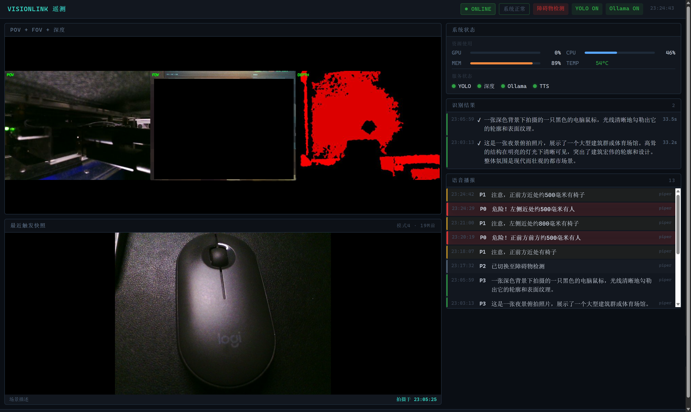
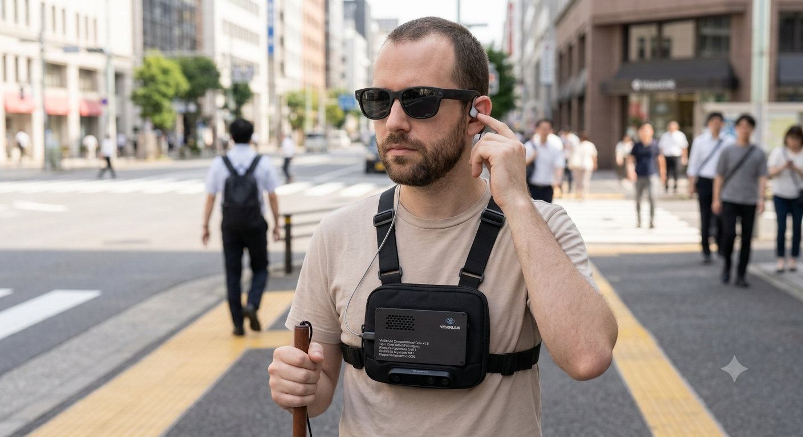
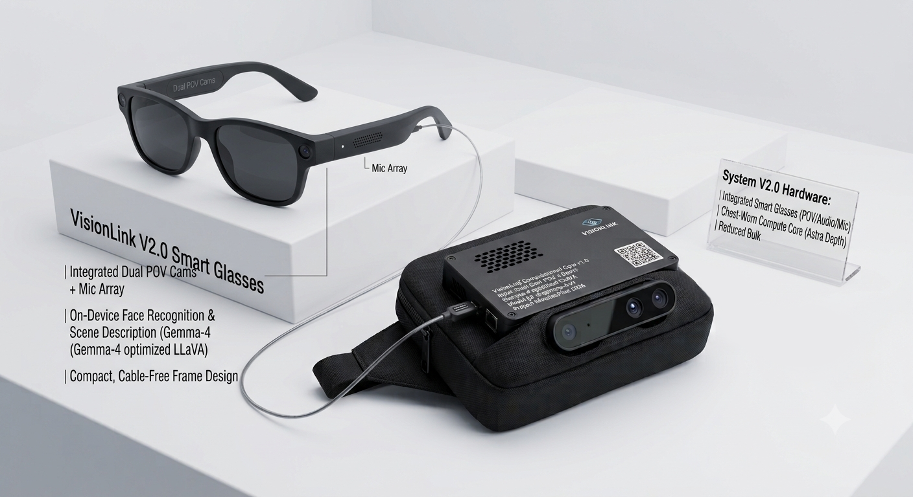

# VisionLink-AI-Glasses

An offline multimodal generative AI assistive system based on Gemma 4 for visually impaired individuals.

> 🎬 **Latest Demo Video**: [Click to watch the Bilibili Demo Video](https://www.bilibili.com/video/BV1FmJJ6rEsn/)

---

## Table of Contents

- [VisionLink-AI-Glasses](#visionlink-ai-glasses)
  - [Table of Contents](#table-of-contents)
  - [Project Introduction](#project-introduction)
  - [Core Dimensions \& Highlights](#core-dimensions--highlights)
  - [Functional Modes](#functional-modes)
  - [Dual-Perspective Hardware Architecture \& BOM](#dual-perspective-hardware-architecture--bom)
    - [1. Software Architecture: "Local for Critical Safety, Cloud for Strategic Intel"](#1-software-architecture-local-for-critical-safety-cloud-for-strategic-intel)
    - [2. Hardware Bill of Materials (BOM)](#2-hardware-bill-of-materials-bom)
  - [Project Structure](#project-structure)
    - [Platform Differences](#platform-differences)
  - [Dependencies \& Deployment](#dependencies--deployment)
    - [1. Windows Desktop Version](#1-windows-desktop-version)
    - [2. Jetson Orin Nano Edge Version](#2-jetson-orin-nano-edge-version)
  - [Accessibility Interaction Guide](#accessibility-interaction-guide)
  - [Product Roadmap](#product-roadmap)
  - [License \& Acknowledgments](#license--acknowledgments)

---

## Project Introduction

**VisionLink-AI-Glasses** is a **fully offline, edge-based embodied AI visual compensation system specifically designed for the visually impaired and specialized industries. Powered by edge-optimized Vision-Language Models (VLMs) and a distributed "Edge-Cloud Collaboration" architecture, the project utilizes a highly integrated, split-type wearable design. It delivers high-real-time, absolute privacy, and zero-operational-cost visual assistance in entirely disconnected environments.

By leveraging lightweight multimodal models for efficient on-device inference, the project aims to create inclusive, barrier-free mobility solutions for the visually impaired population. This deeply aligns with the judging criteria of **Google Hackathon Track B: Multimodal**.

---

## Core Dimensions & Highlights

* **🧠 Cognitive-Level Environmental Reasoning**: Breaking away from the limitations of traditional sensors or small models like YOLO. By deploying the Gemma 4 multimodal large model locally, the system doesn't just "see" obstacles; it understands complex spatial causal relationships (e.g., instead of a rigid prompt like *"Bicycle,"* it whispers, *"A shared bicycle has fallen over on the tactile paving ahead, please bypass it to the left"*).
* **🔒 Absolute Privacy & Zero Operational Cost**: Responding to the strict privacy demands of visually impaired users, 100% of the core operational pipeline runs disconnected on the edge. This achieves physical-level privacy lock and guarantees zero-compute operational costs for the enterprise.
* **⚡ Extreme Edge-Side Quantization Acceleration**: Deeply quantized and fine-tuned for the **NVIDIA Jetson Orin Nano (8GB)** memory profile, compressing VLM slow-thinking cycles into seconds. It is paired with a front-loaded fast-track sensor fusion algorithm to balance global spatial planning with millisecond-level emergency obstacle avoidance.
* **🎒 Cyberpunk-Style Split-Wearable Engineering**: Saying no to top-heavy, anti-ergonomic designs. The headwear (glasses side) only retains a micro-camera and ear-clip bone-conduction headphones (total weight < 30g). The motherboard, cooling fan, and PD battery packs are lowered down to the body's load-bearing center, creating a highly recognizable cyberpunk-style Minimum Viable Product (MVP).

---

## Functional Modes

By deeply integrating three distinct modalities—image vision, text comprehension, and audio broadcasting—the project offers five types of accessibility-friendly interactions:

1. **🟢 YOLO Real-Time Obstacle Avoidance Mode**: YOLOv8 real-time detection of surrounding obstacles (person/car/bicycle, etc.), combined with depth distance estimation for precise relative bearing and distance calculation, with tiered voice alerts (danger/warning) to ensure travel safety.
2. **🟡 Text Reading & OCR Mode**: Accurately recognizes text on pillboxes, street signs, and paper books. Optimized and polished by the VLM, it reads aloud in real time, offering perfect support for OCR and foreign language translation.
3. **🔵 Scene Description Mode**: Provides colloquial, humanized summaries of the surrounding environment (stores, pedestrians, road conditions, etc.) to assist users with daily commuting, social interactions, and spatial awareness.
4. **🟣 Face Detection Mode**: Recognizes facial information in the surroundings to assist in social scenarios.
5. **⚪ Visual Q&A Mode**: Ask the VLM questions freely about the current scene for detailed answers.

---

## Dual-Perspective Hardware Architecture & BOM

The project spans a complete full-stack development path, ranging from **PC prototype verification** to an **integrated edge-side prototype**. To balance high flexibility for daily interactions with high robustness for road hazard avoidance, VisionLink innovatively introduces the **"Dual-Perspective Synergy"** hardware solution:

```text
                ┌──────────────────────────────────┐
                │    VisionLink Dual-Perspective   │
                │          Synergy System          │
                └────────────────┬─────────────────┘
                                 │
       ┌─────────────────────────┴─────────────────────────┐
       ▼                                                   ▼

┌──────────────────────┐                            ┌──────────────────────┐
│ First-Person Perspective│                          │ Third-Person Perspective│
│     (POV) Glasses    │                            │     (FOV) Chest Pack │
├──────────────────────┤                            ├──────────────────────┤
│ Head-tracked Micro   │                            │ Orbbec Astra Plus    │
│ Type-C Camera        │                            │ Matrix Depth Camera  │
├──────────────────────┤                            ├──────────────────────┤
│ High-flexibility     │                            │ Robust, low-latency  │
│ Free Angle of View   │                            │ Ground Field of View │
├──────────────────────┤                            ├──────────────────────┤
│ Scene Understanding, │                            │ Real-time 3D Tactile │
│ OCR, Text Reading    │                            │ Paving Avoidance     │
└──────────────────────┘                            └──────────────────────┘
```

### 1. Software Architecture: "Local for Critical Safety, Cloud for Strategic Intel"

* **Edge Brain (Gemma 4 Local Instance)**: Handles high-frequency, high-real-time obstacle avoidance and daily privacy-sensitive scenarios. It is physically isolated and available 100% offline.
* **Cloud Brain (Cloud VLM API)**: Handles low-frequency, high-consumption deep long-text reading or web information retrieval, serving as a strategic backup for the local brain.

### 2. Hardware Bill of Materials (BOM)

| Hardware Module | Reference Image | Core Specifications & System Function | Est. Price |
| :--- | :---: | :--- | :---: |
| **First-Person Vision (POV)**<br>Head-tracked Single-Lens Glasses |  | **Micro Type-C Camera Module**<br>• Ultra-lightweight, clips seamlessly onto regular glasses frames, allowing the viewpoint to follow head movements naturally.<br>• Responsible for flexible interactive scenarios (text OCR, traffic light recognition, specific object identification, and general knowledge Q&A). | ~¥110 |
| **Edge Computing Brain** |  | **NVIDIA Jetson Orin Nano Dev Kit (8GB)**<br>• The portable core of the system, housed safely in the backpack/chest pack.<br>• Delivers up to 40 TOPS of AI compute, perfectly running the quantized edge-side large language models. | ~¥2599 |
| **Third-Person Vision (FOV)**<br>Chest-Mounted Depth Camera |  | **Orbbec Astra Plus / Micro HD Camera Assembly**<br>• Embedded and secured into the chest rig to maintain a stable horizontal viewpoint.<br>• Outputs real-time 3D Depth Maps, dedicated to path navigation, drop-off detection, and low-lying obstacle avoidance. | ~¥800 |
| **Equipment Carrying Chest Rig** |  | **4-Point Tactical Chest Rig**<br>• Securely carries the Jetson board, depth camera & power bank, freeing both hands.<br>• Keeps equipment center of gravity close to the body for extended wear. | ~¥60 |
| **Audio Output System** |  | **Ear-clip Open-Ear Micro Headphones**<br>• Open-ear design delivers private AI voice feedback without blocking ambient environmental sounds, keeping visually impaired users safe. | ~¥50 |
| **Power Supply System** |  | **High-Output PD Fast-Charging Power Bank (20000mAh / 165W)**<br>• Ergonomic weight distribution design, ensuring over 6 hours of continuous operation for the edge computer under high-throughput inference loads. | ~¥200 |
| **Power Decoy Cable** |  | **Type-C to DC High-Current Decoy Cable**<br>• Built-in PD fast-charging protocol decoy chip, perfectly regulating and stabilizing the power bank's output voltage to match the Jetson motherboard standards. | ~¥20 |

> 💰 **Total hardware cost: approximately ¥3839 (~$525 USD)** (actual developer purchase reference, RMB, July 2026; for budgeting only, prices vary by vendor and over time). If you already own a Jetson board, the incremental cost can be kept under ¥1200.

---

## Project Structure

```text
VisionLink/
├── src/                    # Core Source Code (Cross-platform, 15 modules)
│   ├── platform.py         # Platform detection & environment adaptation
│   ├── config.py           # Unified configuration center
│   ├── camera.py           # Dual camera management (POV glasses + FOV chest)
│   ├── detection.py        # YOLOv8 real-time obstacle detection & depth estimation
│   ├── inference.py        # Ollama multimodal inference (Gemma 4)
│   ├── tts.py              # TTS synthesis (Piper > espeak-ng > edge-tts fallback)
│   ├── ui.py               # UI rendering (YOLO overlay, auto-adapts to headless mode)
│   ├── agent.py            # Core controller (state machine / auto mode / YOLO callback)
│   ├── prompts.py          # Prompt template library (CN/EN bilingual)
│   ├── orbbec_depth.py     # Orbbec Astra Plus depth camera ctypes wrapper
│   ├── volume_control.py   # USB headset physical volume button listener (evdev + amixer)
│   ├── web_dashboard.py    # Web control panel (real-time status / logs / control)
│   ├── web_preview.py      # Web real-time camera preview
│   └── dashboard_status.py # System status data collection
├── apps/                   # Application Entries (4)
│   ├── desktop.py          # Windows/Linux Desktop GUI full-featured edition
│   ├── headless.py         # Jetson headless mode (evdev global keyboard listener)
│   ├── jetson.py           # Jetson terminal keyboard compatible (backward compat)
│   └── web_app.py          # Web control panel standalone entry
├── scripts/                # Diagnostic & testing scripts (4)
│   ├── check_system.py     # One-click system comprehensive diagnostic (8 categories)
│   ├── check_camera.py     # Camera scanning & diagnostic
│   ├── check_audio.py      # Audio device detection & TTS test
│   └── export_yolo_trt.py  # YOLOv8 TensorRT model export
├── tests/                  # Unit tests (pytest)
│   ├── conftest.py         # Test fixtures & mocks
│   ├── test_agent.py       # Agent core logic tests
│   ├── test_config.py      # Config module tests
│   ├── test_detection.py   # YOLO detection module tests
│   ├── test_platform.py    # Platform detection module tests
│   ├── test_prompts.py     # Prompt template tests
│   └── test_tts.py         # TTS module tests
├── .github/workflows/      # CI/CD automated testing pipeline
├── start.sh                # One-click launcher (6 modes)
├── archive/                # Legacy iteration history
├── assets/                 # Static resources (Fonts, Audio)
├── docs/                   # Technical documentation
├── Log/                    # Runtime logs
├── pytest.ini              # pytest configuration
├── requirements.txt        # Universal dependencies
└── requirements-jetson.txt # Jetson-specific dependencies
```

### Platform Differences

| Feature | Windows | Jetson |
| :--- | :--- | :--- |
| Model | `gemma4:e2b` | `gemma4:e2b-it-qat` |
| AI Resolution | 448px | 288px |
| Camera Driver | DSHOW, monocular | V4L2, dual-cam (POV ID=0 + FOV ID=2) |
| TTS Engine | PowerShell SAPI5 | Piper (offline) > espeak-ng > edge-tts |
| Audio Device | Default | AB13X USB Audio (plughw:1,0) |
| UI Environment | Full Panel Display | Auto-adapt Headless / GUI debug window |

---

## Dependencies & Deployment

### 1. Windows Desktop Version

```bash
pip install -r requirements.txt
ollama pull gemma4:e2b
python apps/desktop.py
```

### 2. Jetson Orin Nano Edge Version

```bash
pip install -r requirements-jetson.txt
ollama pull gemma4:e2b-it-qat

# Multiple launch modes
./start.sh              # Default: single-cam POV mode
./start.sh dual         # Dual-cam mode (POV + FOV)
./start.sh full         # Full mode (dual-cam + YOLO avoidance)
./start.sh depth        # Depth avoidance mode (dual-cam + YOLO + Orbbec real depth)
./start.sh gui          # Headless + GUI debug window
./start.sh desktop      # Desktop GUI mode
```

> 💡 **Note**: Network connection is required ONLY during the initial model pull. During subsequent operations, all multimodal inference, YOLO obstacle avoidance, and speech synthesis pipelines run **100% locally and offline**.

---

## Accessibility Interaction Guide

| Hotkey | Corresponding Functional Mode |
| :--- | :--- |
| **Key 1** | Switch to 【YOLO Obstacle Avoidance Mode】（dual-cam + depth estimation + tiered voice alerts） |
| **Key 2** | Switch to 【Text Reading Mode】（OCR + VLM polishing） |
| **Key 3** | Switch to 【Scene Description Mode】（colloquial environment summary） |
| **Key 4** | Switch to 【Face Detection Mode】 |
| **Key 5** | Switch to 【Visual Q&A Mode】（free-form questions） |
| **Spacebar** | **Trigger Interaction**: Capture Photo → Local VLM Processing → Earphone Audio Broadcast |
| **M Key** | Toggle 【Auto Mode】：timed auto-capture + YOLO avoidance |
| **S Key** | Stop current speech playback |
| **ESC / Q Key** | Exit and safely terminate the program |

> 💡 In headless mode, the system uses **evdev global keyboard listener** (auto-detects `/dev/input/event*` physical keyboard), no window focus required.

---

## New Features

### USB Headset Physical Volume Buttons

In headless mode, physical volume +/- buttons on USB headsets have no effect by default (ALSA direct connection lacks HID event handling). The `src/volume_control.py` module listens for HID volume key events via evdev and automatically adjusts the sound card volume through amixer.

- Auto-discovers the headset's `/dev/input/event*` device
- Supports hot-plug with automatic reconnect on device disconnect
- Graceful degradation: silently falls back if no device is detected
- Auto-starts with the application, no extra configuration needed

### Web Telemetry Dashboard

VisionLink includes a built-in web telemetry dashboard. Open it on any phone/computer browser on the same LAN to monitor system status in real time:



**How to access**: After launching the program, open `http://<Jetson_IP>:5000` in a browser.

**Modules**:

| Module | File | Description |
| :--- | :--- | :--- |
| Data Collection | `src/dashboard_status.py` | Thread-safe singleton tracking mode/YOLO/depth camera/Ollama connection status; inference/detection/TTS event logs (ring buffer, max 50 per type) |
| Hardware Telemetry | `src/dashboard_status.py` | Jetson platform via jtop (GPU/CPU/Memory/Temperature), non-Jetson via psutil fallback |
| Web Dashboard | `src/web_dashboard.py` | Flask routes + HTML page, dark terminal-style UI, real-time GPU/CPU/MEM/TEMP gauges, mode status, event log streams |
| Video Stream | `src/web_preview.py` | MJPEG real-time video stream (`/video_feed`), background daemon thread, non-blocking |

**Dashboard page features**:
- **Hardware Status**: GPU usage, CPU usage, memory, chip temperature, refreshed every 2s
- **App Status**: Current mode, YOLO on/off, depth camera connection, Ollama connection, auto mode status
- **Real-time Logs**: Inference results (with latency), obstacle detection (danger/warning tiers), TTS playback records
- **Latest Snapshot**: Most recent recognition result and corresponding image

### Unit Tests & CI

The project now integrates pytest testing framework, covering core modules:

| Test File | Module Covered |
| :--- | :--- |
| `tests/test_agent.py` | Agent state machine & core logic |
| `tests/test_config.py` | Config loading & validation |
| `tests/test_detection.py` | YOLO detection pipeline |
| `tests/test_platform.py` | Platform detection & adaptation |
| `tests/test_prompts.py` | Prompt template rendering |
| `tests/test_tts.py` | TTS multi-level fallback logic |

```bash
# Run all tests
pytest tests/ -v

# Run single module tests
pytest tests/test_agent.py -v
```

CI runs automatically on every push via `.github/workflows/ci.yml`.

---

## Product Roadmap

* [x] **Phase 1 (PC Demo)**: Completed core pipeline execution on PC; validated three core multimodal application modules.
* [x] **Phase 2 (Edge Porting)**: Successfully ported the code stack to **Jetson Orin Nano (8GB)**; achieved memory optimization via INT4/INT8 quantization.
* [x] **Phase 3 (Engineering Refactor)**: Modularized the code architecture; unified cross-platform interfaces and added headless mode support.
* [x] **Phase 4 (Hardware Integration)**: Fabricated the prototype for the head-tracked micro Type-C glasses camera; initially verified POV image capture stability.
* [x] **Phase 5 (YOLO + Dual-Cam Fusion)**: Completed YOLOv8 real-time obstacle avoidance + depth distance estimation + dual-perspective fusion; global keyboard interaction in headless mode.
* [x] **Phase 5.5 (Polishing & Tooling)**: USB headset physical volume button support, web control panel & real-time preview, pytest unit test framework & CI/CD pipeline, Orbbec depth avoidance mode.
* [ ] **Phase 6 (Product Enclosure)**: Complete 3D nylon printing for ergonomic wearable kits; seamlessly modify the tactical chest pack for motherboard concealment and passive cooling.
* [ ] **Phase 7 (Vertical Expansion)**: Cross over to neighboring verticals, transferring technologies into network-isolated industrial inspection robotics and healthcare monitoring for elderlies with dementia.

  **Future Concept Design**:

  
  

---

## License & Acknowledgments

* This project is licensed under the **MIT License** - see the LICENSE file for details (commercial usage, modifications, and redistribution permitted).
* Special thanks to the **Google Hackathon** for providing the grand stage to showcase our technology.
